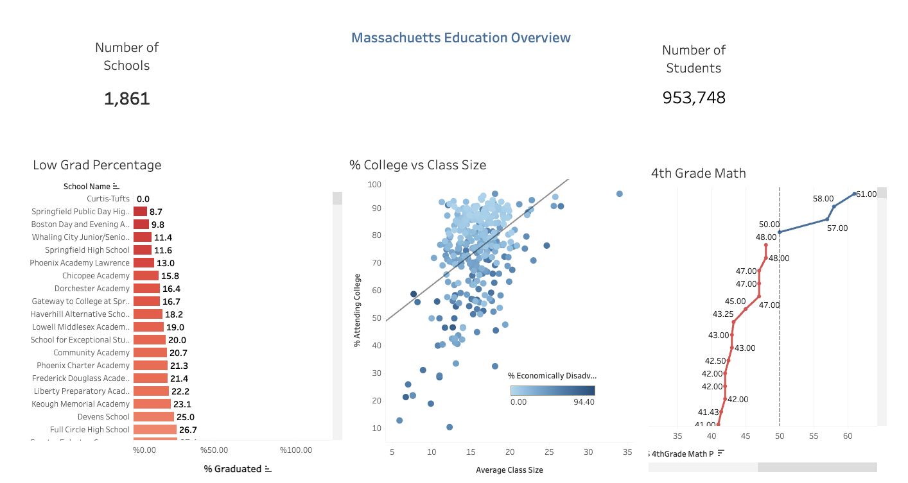

# Massachusetts Education Analysis Dashboard

## Overview
This project analyzes education performance data across Massachusetts schools using Tableau and Excel. The goal was to explore relationships between graduation rates, class sizes, college attendance percentages, and academic performance metrics.

## Objectives
- Analyze graduation rates across Massachusetts schools
- Examine the relationship between class size and college attendance rates
- Identify trends in academic performance and socioeconomic factors
- Visualize statewide education data through an interactive dashboard

## Tools Used
- Excel (data preparation)
- Tableau (data visualization and dashboard creation)

## Dashboard Features
- Statewide education KPI overview
- Graduation rate comparison analysis
- College attendance vs. class size scatterplot
- Academic performance trend visualization

## Key Insights
- Smaller class sizes generally showed higher college attendance percentages
- Economically disadvantaged schools tended to have lower academic performance metrics
- Several schools had significantly lower graduation percentages compared to state averages

## Tableau Dashboard
https://public.tableau.com/app/profile/luke.burbank1441/viz/Massschoolproject/Dashboard1
